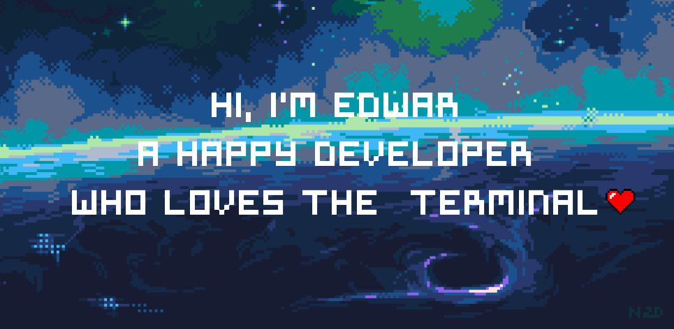

  I'm a full stack web developer 🧑‍💻, who is mainly focused on the front-end 💄, I want to explore and realize the full potential of the browser to craft beautiful and performant websites with a good UX 💻. I'm always looking for learning and improving my developer skills like write code that meet the clean code principle, design patterns, architectural patterns, domain driven design 👷.

<h3 align="center">My Github Stats</h3>

  

  

